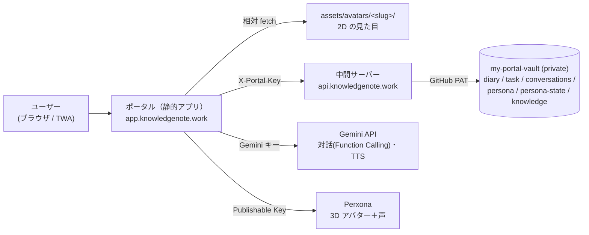
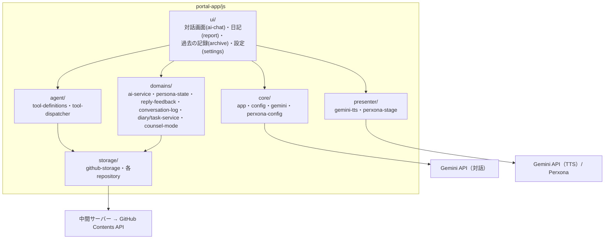

# my-portal 設計ドキュメント

日記・タスク・AIアバターの個人用ポータルの設計ハンドブック。**「いまの姿」を常に正として維持する**リビングドキュメントで、テーマ別の6ページ＋決定ログ1枚で構成する。

- アプリ本体: `my-portal`（public）— ビルド工程なしの静的Webアプリ。`app.knowledgenote.work`（Cloudflare）で配信し、Pixel には TWA で入れる
- 中間サーバー: `worker-proxy/`（`api.knowledgenote.work`）— vault への読み書きを中継。GitHub PAT はここにだけある
- データ: `my-portal-vault`（private）— 日記・タスク・会話ログ・人格（card.json）・記憶
- キャラクターは3層: 人格（vault に1つ）／見た目（2D 立ち絵 or 3D Perxona）／声（2D→Gemini TTS、3D→Perxona）

## 全体構成

- 学習用の解説（仕組みの説明・用語・演習）は vault の `knowledge/my-portalアーキテクチャ学習ノート.md` にある

データの流れの要点: ユーザーの発話 → `ai-chat.js` がシステムプロンプト（人格＋記憶＋日時＋規律）を組み立て Gemini を直接呼ぶ → ツール呼び出しは `tool-dispatcher` が `github-storage` 経由（中間サーバー）で vault を読み書き → 返答は画面に出すと同時に `avatar-scene.js` の `speak()` が見た目に応じて Gemini TTS か Perxona で読み上げる → 会話は1往復ごとに全文が vault の会話ログへ自動追記される。

## ページ案内

| ページ | 扱う範囲 |
|---|---|
| [persona.md](persona.md) | 人格・表示・音声の3層モデル（人格=vault / 見た目=公開）・3D（Perxona）・記憶（persona-state）・「覚えて」 |
| [conversation.md](conversation.md) | 対話UI（VN方式）・エージェントループ・プロンプト規律・会話ログ・フィードバックループ・定期改善の手順 |
| [storage.md](storage.md) | GitHub Contents API・2リポジトリ境界・PAT・競合制御・追記/上書きガード |
| [diary-tasks.md](diary-tasks.md) | 日記のファイル規約・チェックリスト・タスク・メモ・振り返り・月次まとめ |
| [demo-deploy.md](demo-deploy.md) | デプロイ（Cloudflare / Pages）・中間サーバー・TWA・キャッシュバスト運用 |
| [decisions.md](decisions.md) | 決定の時系列1行ログ（このドキュメント群への反映先つき） |

## このドキュメントの運用ルール

1. **作業ごとに新ファイルを作らない。** 仕様が変わったら該当ページの「いまの仕様」を書き換える
2. 変更の理由・経緯は同ページの「変遷」に日付つき1〜5行で追記する（新しいものを上に）
3. あわせて decisions.md に1行追記する
4. 構成が変わったらこの README の図も同時に更新する
5. 各ページは「## いまの仕様（常に正）」「## 変遷」「## 既知の問題・残課題」の3部構成を守る
6. 画面に表示される文言に、このドキュメントの用語・ページ名などシステム的な語を書かない
7. 対話画面のAIには、この README の冒頭が「アプリの全体像」としてコンテキスト注入される（ai-service.js）。冒頭部分は簡潔に保つ

## 来歴（大きな方針転換の要約）

- **2026-08-15**: ADR運用（決定1件=1ファイル・連番56件）を廃止し、本ハンドブック方式へ移行。細切れで俯瞰できず、「関連」参照も過半で書かれなかったため。同日、ドキュメント自体を vault から本リポジトリへ移設（PAT不要でAIに注入できる・コードと同居する）。旧ADR全文は my-portal-vault の git 履歴（`vault/docs/adr/`）に残る
- **2026-08-06**: 公開面と非公開面をリポジトリ境界で分離（my-portal / my-portal-vault）。それ以前の履歴933コミットは意図的に破棄済みで存在しない
- **2026-07-31〜**: UIを「Ambient Companion」（アバター常駐の対話画面）へ刷新し、会話ログ起点の改善ループを整備
- **〜2026-07**: 当初の「多機能アプリ基盤」路線（Next.js/TypeScript化・Backlog等の外部連携・アプリカタログ・家計管理）を放棄し、**AIアバターと日記に絞った静的アプリ**へ転換
- 保留中の構想: Cloudflare + 独自ドメインへの移行（アカウント取得待ち）・フレームワーク導入・ペルソナ作成機能（詳細は各ページの残課題欄）
- **2026-09-13〜2026-09-22**: AIアバター強化（3D・音声・リップシンク）に Perxona Connect Kit を採用し統合完了。詳細は [persona.md](persona.md)「3D アバター・音声（Perxona Connect Kit）」。計画書 `docs/plans/perxona-integration.md` は完了に伴い削除
